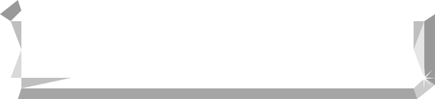
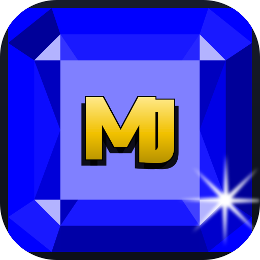

# Icon candidates

Three takes on an app icon for MnemoJewels, each a square blue jewel with a gold
**MJ** monogram. They reuse the game rather than inventing a style:

- **the jewel is `public/images/jewel.svg`** — the exact bevel/gloss/facet overlay the
  game paints over a coloured tile, drawn over the game's tile colour, CSS `blue`
  (`#0000ff`). Nothing is re-tinted or re-shaded.
- **the jewel is nine-sliced to a square.** The gem is authored wide (610×140) with 30px
  end-caps. The caps hold the bevel and facet geometry and are scaled uniformly, so they
  keep their shape; only the repeating gloss band between them stretches. The game
  stretches the whole gem over a tile (`background-size: 100% 100%`), which would squash
  the caps on a square icon — this keeps them.
- **the sparkle is the jewel's own.** `jewel.svg` already carries an 8-point shine near its
  bottom-right; it is scaled up about its centre, not replaced by a new star elsewhere.
- **the monogram is the app's logo font (Russo One)**, cut to outlines and given the logo's
  own black rim — a hard `0.05em` shadow on the four diagonals, plus the soft lower shadow,
  straight from `stylesheet/logo.css`. The rim is a dilated copy of the glyph, so it wraps
  the whole outline including the J's right side (a centred stroke leaves it bare).

The monogram is emitted as **vector outlines** rather than `<text>` with a `@font-face`:
standalone SVGs (launcher icons, `raw.githubusercontent.com` images in a README or PR, and
`@vite-pwa/assets-generator`) don't fetch webfonts, so `<text>` would silently fall back to
a default face. `generate-icons.mjs` regenerates the outlines from the font, so they still
track the logo.

## Reference

The in-game tile — CSS `blue` with `jewel.svg` stretched over it — is the shape every
candidate is matched against:



## Candidates

**01 — blue jewel + gold MJ (default)** — the J sits beside the M, a touch below its
baseline.

   

**02 — J dropped** — the J is nudged further down, so its hook reads more clearly at small
sizes.

   

**03 — J tucked under the M leg** — the J is pulled left so it overlaps the M's right leg,
making the mark read as one tight monogram.

   

The last image in each row is a circular crop, to check maskable behaviour.

`contact-sheet.png` is a rasterised comparison sheet (reference tile + all three at 192px
with a 96px circular crop), and `preview.html` is a self-contained gallery. Both are
regenerated by `render-preview.mjs`.

## Styling lab (`jewel-mj.html`)

`jewel-mj.html` is a standalone scratch pad for positioning the monogram: the square jewel
as inline SVG (`jewel-square.svg`, jewel only, no letters), with **M** and **J** as
absolutely-positioned spans on top. The letters use the real logo font and the exact
`text-shadow` from `stylesheet/logo.css`, so tuning is pure CSS — no path math.

The CSS variables at the top of the file are the knobs; every length is in the icon's
512-unit design space (so `--icon: 512px` means 1 unit = 1px, and changing `--icon` scales
the whole thing):

```css
--cap: 123;     /* letter cap height, units */
--m-left: 141;  /* M's left edge, units */
--m-drop: 0;    /* M's baseline drop, positive = lower */
--j-left: 289;  /* J's left edge, units */
--j-drop: 4;    /* J's baseline drop */
```

Click the icon to toggle centre guides. Once the numbers are right, they are baked into
`generate-icons.mjs` (as em fractions) so the candidates match.

Open it via a local server so the webfont loads, e.g.:

```sh
python3 -m http.server 12000   # then visit /assets/icons/jewel-mj.html
```

## Regenerating

```sh
node assets/icons/generate-icons.mjs   # icon sources (MJ outlines from the logo font)
node assets/icons/render-preview.mjs   # preview.html + contact-sheet.png
```

To ship a favourite as the app icon:

```sh
cp assets/icons/<chosen>.svg public/icon.svg
npx pwa-assets-generator --config pwa-assets.config.mjs public/icon.svg
```

That rewrites `favicon.ico`, `pwa-{64,192,512}.png`, `maskable-icon-512x512.png` and
`apple-touch-icon-180x180.png` in `public/`.
