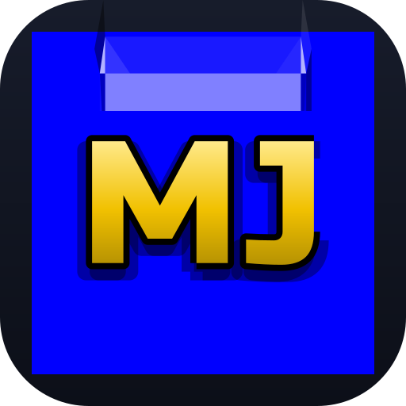

# Icon candidates

Four takes on an app icon for MnemoJewels, each a blue jewel with a gold **MJ**
monogram. They reuse the game rather than inventing a style:

- **the jewel is `public/images/jewel.svg`** — the exact bevel/gloss/facet overlay the
  game paints over a coloured tile, drawn over the game's tile colour, CSS `blue`
  (`#0000ff`). Nothing is re-tinted or re-shaded.
- **the jewel is drawn 9-slice.** The game stretches the overlay over a whole tile
  (`background-size: 100% 100%`), which squashes the 30px end facets on a square icon.
  Here the end-caps stay square and only the repeating middle stretches, so the facets
  keep their true shape.
- **the monogram is the app's logo font (Russo One)**, cut to outlines and given the
  logo's own black rim — a hard `0.05em` shadow on the four diagonals, plus the soft
  lower shadow, straight from `stylesheet/logo.css`.

The monogram is emitted as **vector outlines** rather than `<text>` with a `@font-face`:
standalone SVGs (launcher icons, `raw.githubusercontent.com` images in a README or PR,
and `@vite-pwa/assets-generator`) don't fetch webfonts, so `<text>` would silently fall
back to a default face. `generate-icons.mjs` regenerates the outlines from the font, so
they still track the logo.

---

## 01 — blue jewel + gold MJ (default)

  


The jewel fills the frame, with a four-point shine overflowing its bottom-right corner.

---

## 02 — J dropped

  


Same as 01, but the J is nudged down (a touch more than the logo's own baseline) so its
hook reads more clearly at small sizes.

---

## 03 — octagonal jewel

  


The same jewel clipped to an emerald-cut octagon, so the "jewel" silhouette reads even
where the launcher shows the icon on its own.

---

## 04 — plain (no shine)

  


01 without the corner shine, for a quieter mark.

---

## Regenerating

```sh
node assets/icons/generate-icons.mjs   # icon sources (MJ outlines from the logo font)
node assets/icons/render-preview.mjs   # preview.html + contact-sheet.png
```

To ship a favourite as the app icon:

```sh
cp assets/icons/<chosen>.svg public/icon.svg
npx pwa-assets-generator --config pwa-assets.config.mjs public/icon.svg
```

That rewrites `favicon.ico`, `pwa-{64,192,512}.png`, `maskable-icon-512x512.png` and
`apple-touch-icon-180x180.png` in `public/`.
