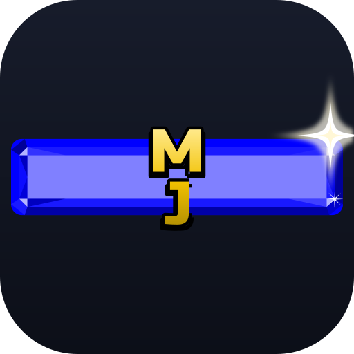

# Icon candidates

Four takes on an app icon for MnemoJewels, each a blue jewel with a gold **MJ**
monogram. They reuse the game rather than inventing a style:

- **the jewel is `public/images/jewel.svg`** — the exact bevel/gloss/facet overlay the
  game paints over a coloured tile, drawn over the game's tile colour, CSS `blue`
  (`#0000ff`). Nothing is re-tinted or re-shaded.
- **the jewel keeps its true 610:140 aspect.** `jewel.svg` is a wide gem (~4.36:1); the
  game stretches it across a whole tile (`background-size: 100% 100%`), which would squash
  the end facets on a square icon. Here the jewel is scaled uniformly instead, so the
  facets and gloss band keep their real proportions.
- **the monogram is the app's logo font (Russo One)**, cut to outlines and given the
  logo's own black rim — a hard `0.05em` shadow on the four diagonals, plus the soft
  lower shadow, straight from `stylesheet/logo.css`.

The monogram is emitted as **vector outlines** rather than `<text>` with a `@font-face`:
standalone SVGs (launcher icons, `raw.githubusercontent.com` images in a README or PR,
and `@vite-pwa/assets-generator`) don't fetch webfonts, so `<text>` would silently fall
back to a default face. `generate-icons.mjs` regenerates the outlines from the font, so
they still track the logo.

## Reference

The in-game tile — CSS `blue` with `jewel.svg` stretched over it — is the shape every
candidate is matched against:


## Candidates

**01 — blue jewel + gold MJ (default)** — the J sits beside the M, a touch below its
baseline. The jewel fills the frame with a four-point shine at its top-right corner.

   

**02 — J dropped** — the J is nudged further down, so its hook reads more clearly at
small sizes.

   

**03 — J tucked under the M leg** — the J is pulled left so it overlaps the M's right leg,
making the mark read as one tight monogram.

   

**04 — M over J** — the J drops below the M, stacking the monogram into a squarer mark.

   

The last image in each row is a circular crop, to check maskable behaviour.

`contact-sheet.png` is a rasterised comparison sheet (reference tile + all four at 192px
with a 96px circular crop), and `preview.html` is a self-contained gallery. Both are
regenerated by `render-preview.mjs`.

## Regenerating

```sh
node assets/icons/generate-icons.mjs   # icon sources (MJ outlines from the logo font)
node assets/icons/render-preview.mjs   # preview.html + contact-sheet.png
```

To ship a favourite as the app icon:

```sh
cp assets/icons/<chosen>.svg public/icon.svg
npx pwa-assets-generator --config pwa-assets.config.mjs public/icon.svg
```

That rewrites `favicon.ico`, `pwa-{64,192,512}.png`, `maskable-icon-512x512.png` and
`apple-touch-icon-180x180.png` in `public/`.
