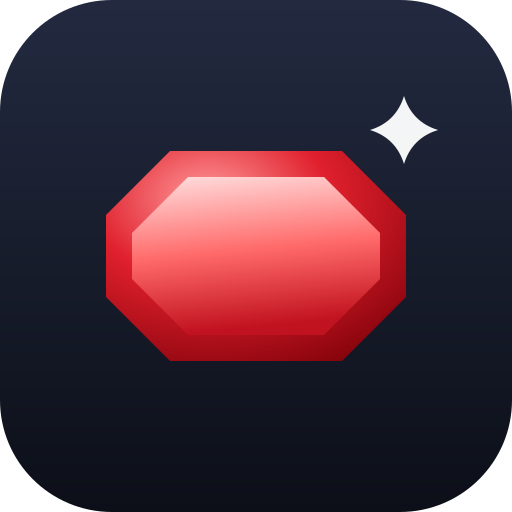
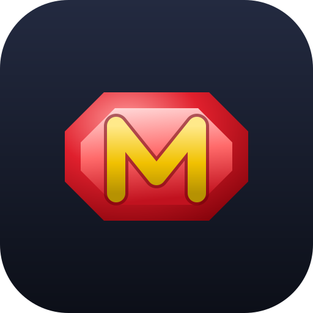
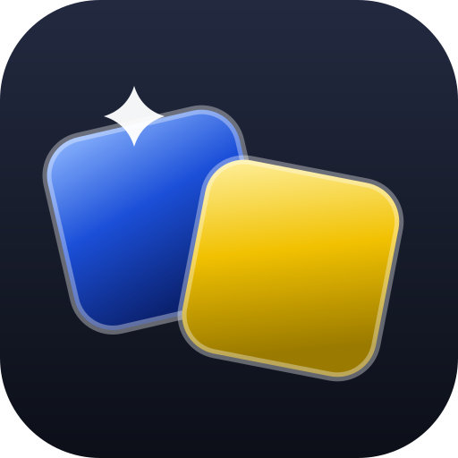
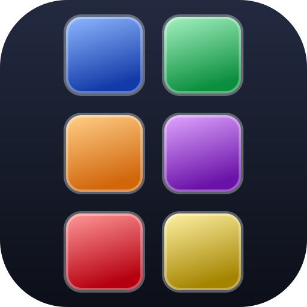

# Icon candidates

Five icon directions for the app, inspired by the gold "MnemoJewels" logo, the jewel
buttons on the main menu (red / yellow / green / blue / purple emerald-cut gems), and the
2-column game board. Each is shown below at 48 / 96 / 192 px, and then as a circular
crop to check how it survives a maskable launcher icon.

The current temporary icon is **02 — jewel + monogram** (copied to `public/icon.svg`).

---

## 01 — emerald-cut jewel

  


A single red emerald-cut jewel. The most literal reading of the "jewel" theme, matching
the red **Play** button.

---

## 02 — jewel + monogram (temporary)

  


The jewel with a gold "M" cut into the table. Ties the jewel motif to the brand initial.

---

## 03 — tile pair

  


Two jewel tiles side by side — a match, which is the core loop of the game.

---

## 04 — board

  


A small board of jewel tiles, echoing the 2-column playfield. The most detailed option;
reads well large, busiest small.

---

## 05 — monogram

  


A gold "M" monogram on the app's dark navy. The simplest, most legible at small sizes.

---

## Regenerating the PWA icon set

Once a favourite is chosen:

```sh
cp assets/icons/<chosen>.svg public/icon.svg
npx pwa-assets-generator --config pwa-assets.config.mjs public/icon.svg
```

That rewrites `favicon.ico`, `pwa-{64,192,512}.png`, `maskable-icon-512x512.png` and
`apple-touch-icon-180x180.png` in `public/`.

`render-preview.mjs` regenerates `preview.html` and `contact-sheet.png` (a rasterised
comparison sheet) from whatever `*.svg` files sit in this directory:

```sh
node assets/icons/render-preview.mjs
```
