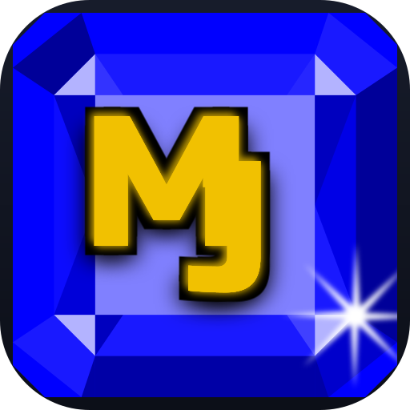

# Icon candidates

A blue emerald-cut jewel with a gold **MJ** monogram cut from the app's own logo font
(**Russo One**, `public/fonts/russo_one.ttf`), plus a small shine. These replace the
earlier red/gold explorations.

The monogram is baked into each SVG as **vector outlines** rather than `<text>` with a
`@font-face`: standalone SVGs (launcher icons, `raw.githubusercontent.com` images in a
README or PR, and `@vite-pwa/assets-generator`) don't fetch webfonts, so `<text>` would
silently fall back to a default face. Outlines render identically everywhere. They are
regenerated from the font with `generate-icons.mjs`, so they still track the logo font.

Each option is shown at 48 / 96 / 192 px, then as a circular crop to check how it
survives a maskable launcher icon.

---

## 01 — blue jewel + gold MJ (sparkle)

  


Gold MJ centred on the blue table, a gloss band across the top, and a four-point shine
top-right. The closest match to the original idea.

---

## 02 — larger monogram

  


Same treatment but the MJ fills more of the jewel, so it stays readable at 48 px.
Slightly heavier gold-on-blue.

---

## 03 — embossed / faceted

  


Adds a gold rim around the table and a couple of facet lines, so it reads more like a
cut gemstone than a flat badge.

---

## 04 — flat and minimal

  


No sparkle, just a single gloss band. Cleanest at small sizes.

---

## Regenerating

Icon sources are produced by `generate-icons.mjs` (extracts the MJ outlines from the
logo font):

```sh
node assets/icons/generate-icons.mjs
```

To ship a favourite as the app icon:

```sh
cp assets/icons/<chosen>.svg public/icon.svg
npx pwa-assets-generator --config pwa-assets.config.mjs public/icon.svg
```

That rewrites `favicon.ico`, `pwa-{64,192,512}.png`, `maskable-icon-512x512.png` and
`apple-touch-icon-180x180.png` in `public/`.

`render-preview.mjs` regenerates `preview.html` and `contact-sheet.png` from whatever
`*.svg` files sit in this directory.
